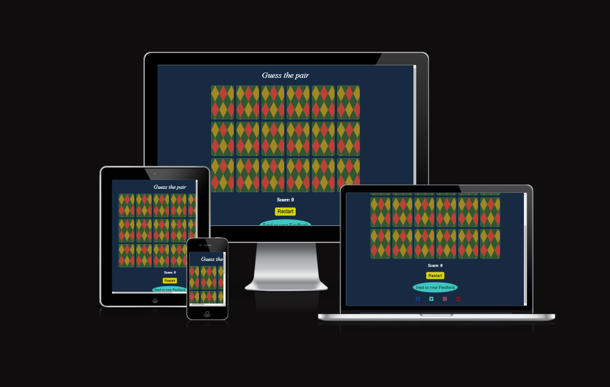
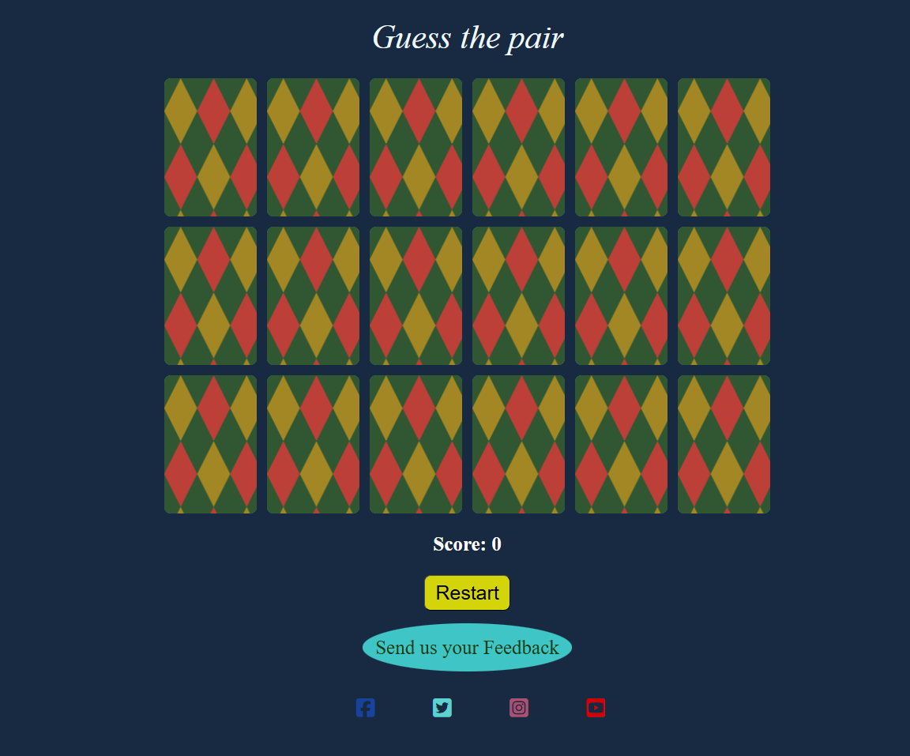
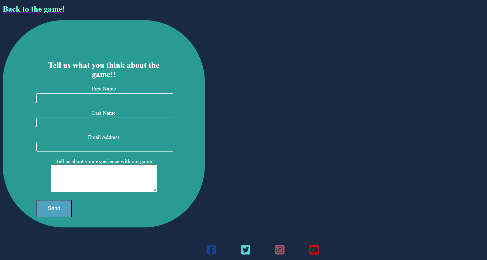
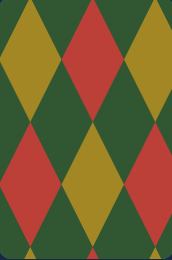
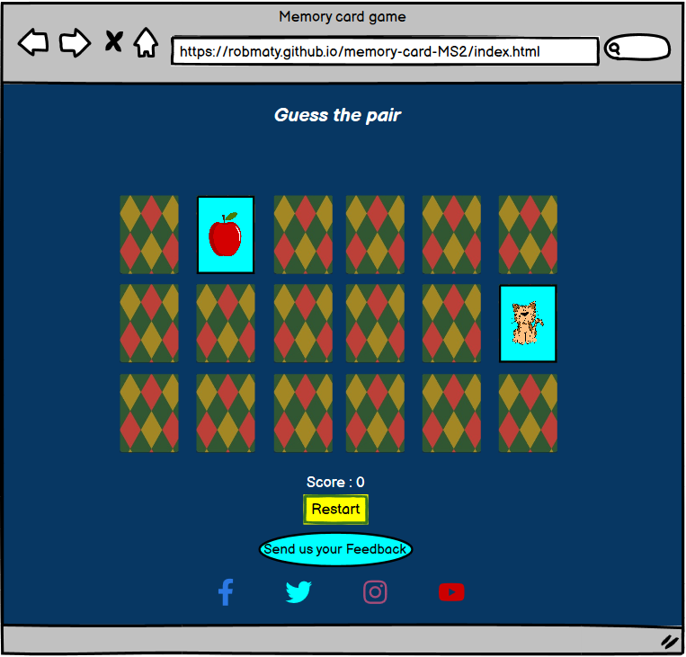
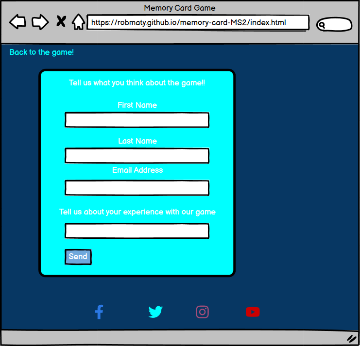
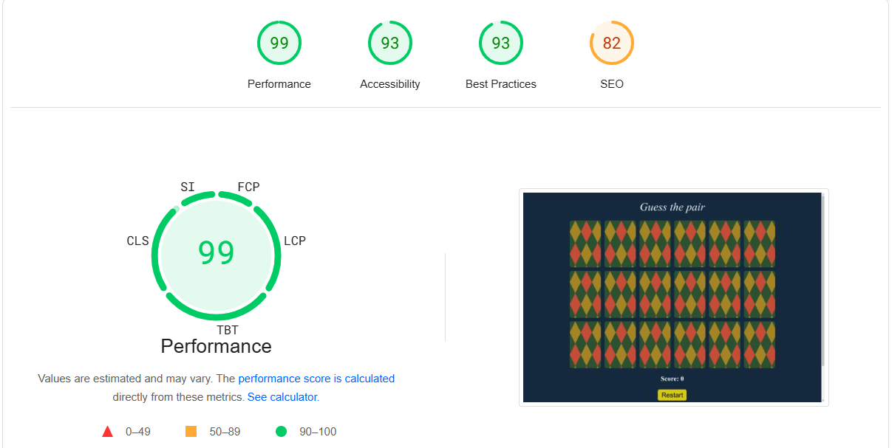
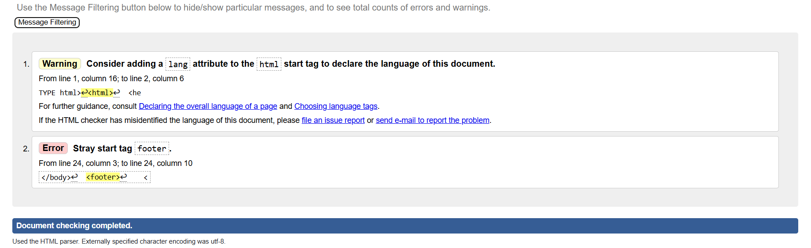
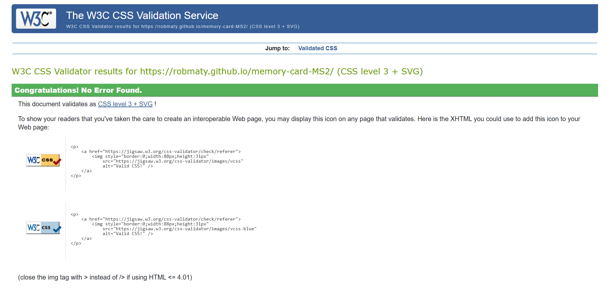

# Memory Match Card

**View Live Project:** [Memory Match Game](https://robmaty.github.io/memory-card-MS2/)

## Introduction
Memory Match Card is a simple yet challenging game that tests the user's ability to uncover and remember the placement of cards on a gameboard. The game offers a 9 different cards for match which challenges the player to remember most of them.

## Purpose
Memory Match Card is design to provide fun for all ages while helping players improve their short-term memory and cognitive skills by reinforcing pattern recognition.

## User Experience (UX) 
### User Stories
- As a user, I want to quickly understand how to play.
- As a user, I want to reset the game if I choose to start over.
- As a user, I want a visually appealing game.
- As a user, I want to play on multiple devices.

## Features
### **Front Page** - Displays the game tittle and the game cards.

### **Feedback Page** - Displays a feedback form that the user can fill up with their experience about the game.

### Game Screen
- Display a 4X4 grid of 16 cards.
- Show the point you achieved.
- Provides a reset button and a menu button.
- Provide a button to the Feedback form.

## Design
### Color Scheme
The game features a black and light blue theme.

### Card Designed
For the design of the back of cards I used (https://pattern.monster/diamonds-2#google_vignette)

### Typography
- **Oswald** (fallback: sans-serif) for body text.

### Wireframes
All wireframes were created using **Balsamiq**.
Here are the models for the Game page and Feedback Page. 

## Technologies/Languages Used
- **HTML5** for structure
- **CSS** for styling
- **JavaScript** for game functionality

## Tools & Libraries
- **Font Awesome** for icons
- **Git & GitHub** for version control and hosting

## Testing
### Manual & Automated Testing
- Ensured functionality of navigation, buttons, and game logic.
- Verified cross-browser compatibility (Chrome, Firefox, Edge, Safari).
### DevTools
Lighthouse results

### Validator Testing
- **HTML** - Validated with W3C Markup Validator.

- **CSS** - Checked using W3C CSS Validator.

### Fixed Bugs
- Resolved card duplication issue in `createHardBoard()` function.

## Deployment 
### GitHub Pages
1. Go to **GitHub Repository**.
2. Navigate to **Settings** > **GitHub Pages**.
3. Under "Source," select **Main Branch**.
4. The site will be published with a public URL.

### Forking & Cloning the Repository
### Cloning the Repository

To create a local clone:

1. Log in to GitHub and locate the repository.
2. At the top of the repository, click on "Code".
3. From the dropdown menu under HTTPS, copy the link.
4. On the IDE, create a directory where you want to clone the repository.
5. Type `git clone` and paste the copied link.

### Forking the Repository

To fork the GitHub repository:

1. Log in to GitHub and locate the repository.
2. At the top of the repository, just above the "Settings" button on the menu, locate the "Fork" button.
3. You should now have a copy of the original repository in your GitHub account.

   ## Credits
### Code References
- **•	Favicon.io** - images were used for the footer social-media links.
- **W3Schools** - Flip effect for cards
- **GeeksforGeeks** - Card shuffling logic
- **Medium & SheCodes** - Timer implementation guidance

### Acknowledgments
Special thanks to my **Tutor (Miguel)** and **Mentor (Mo Shami)** for their guidance throughout this project.